Overview
========

Visual Studio 2017 now come with Azure Function Tools enables you to develop
Azure Function App locally. The tool supports library type of Function app
development which is not compatible with Function App’s source control based
CI/CD options.

In order to create our CI/CD pipeline for Azure Function App. We will be
leveraging VSTS to automatically deploy to Azure when new codes are committed.

Create Function App in VS 2017
==============================

We are not going to detail those steps to create local Function App in VSTS
here. You can refer to [official
document](https://docs.microsoft.com/en-us/azure/azure-functions/functions-develop-vs)
for instruction. The structure of our VS 2017 solution looks like below.

You need to commit these codes to your VSTS repository

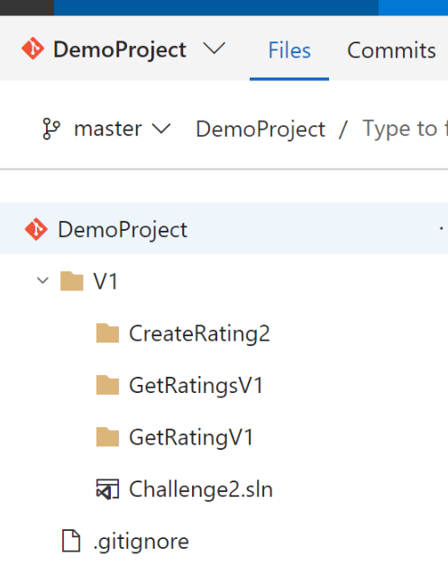

Create Build Definition
=======================

-   Goto Build and Release, then create a new definition

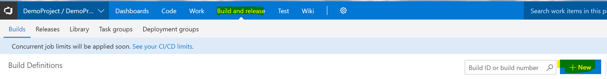

-   You choose correct VSTS repository and branch, then click “Continue”

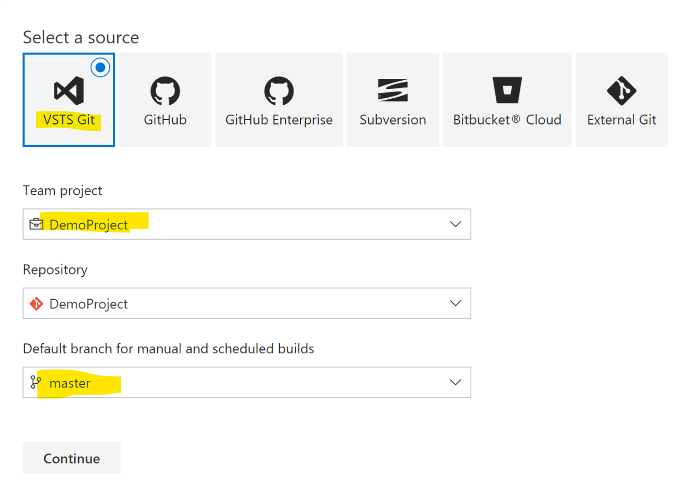

-   Let’s use Azure App Service template

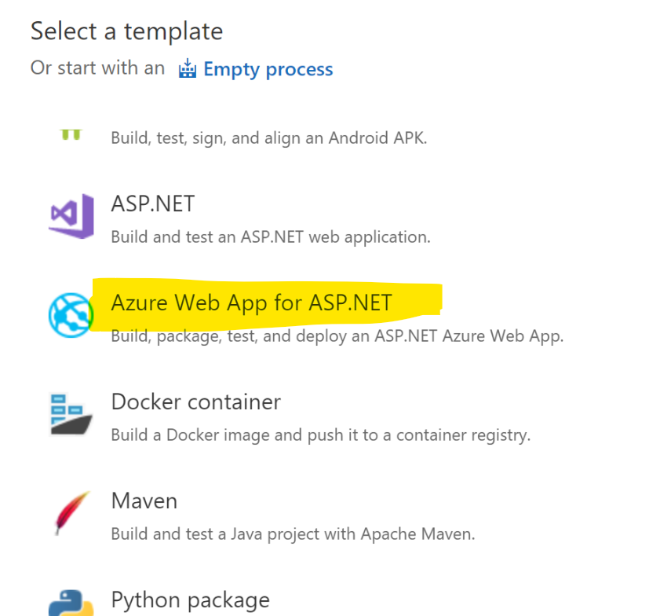

-   Once selected, you will be shown a default template looks like below. Click
    the Azure App Deploy task we just selected.

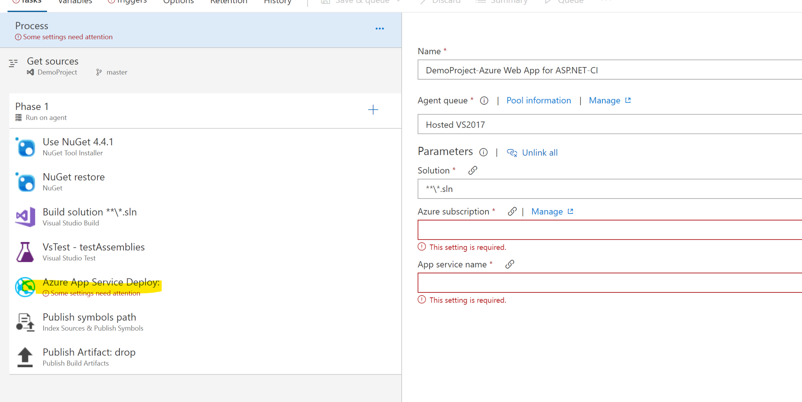

-   Choose Azure Subscription which the Function App will be deploying to

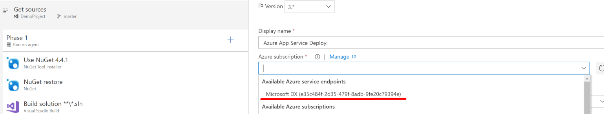

-   Fill in required information.

    Note that value of “Package or folder” should be
    \$(build.artifactstagingdirectory)/\*\*/{PACKAGE_NAME}.zip.

    Since here we have below packages as shown in VSTS solution, we will be
    creating totally three Azure App Service Deploy tasks for each package

    -   CreateRatingV1

    -   GetRatingV1

    -   GetRatingsV1

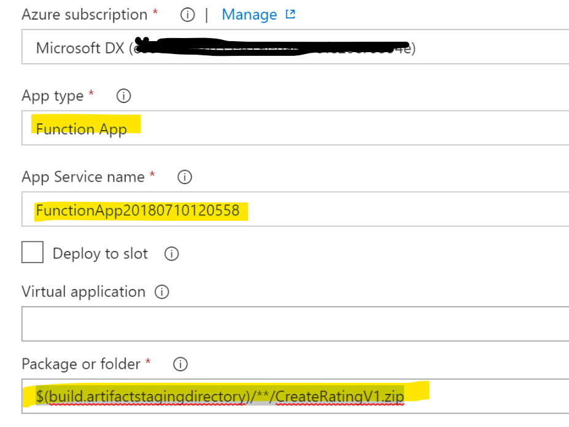

-   Add another deploy task for GetRatingsV1 package

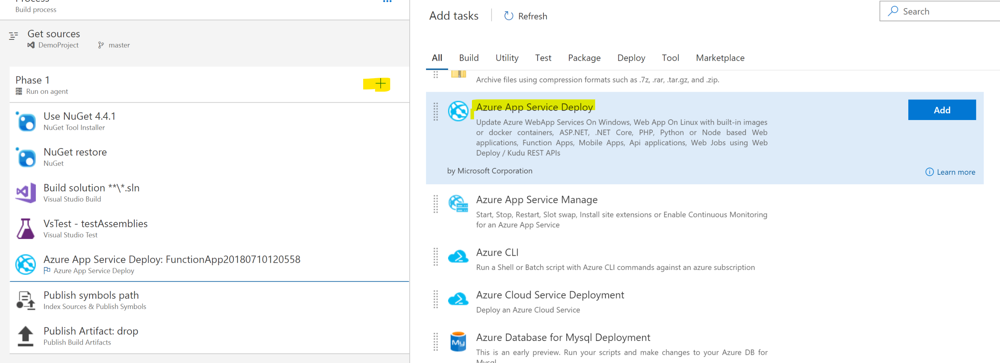

-   Your task should look like this.

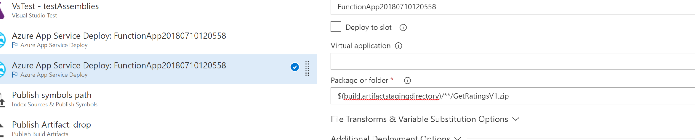

-   Add another one for GetRatingV1, your Build should looks like below

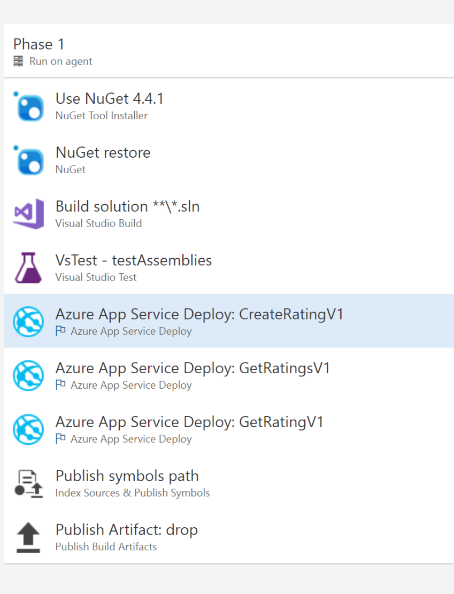

-   Goto Trigger, click Add

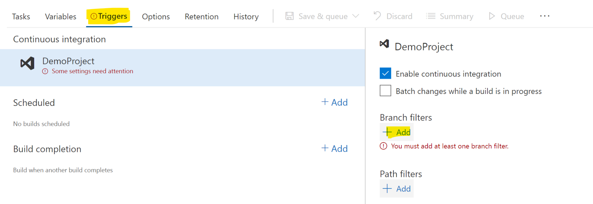

-   Enable CI and make sure to select a branch to integrate with

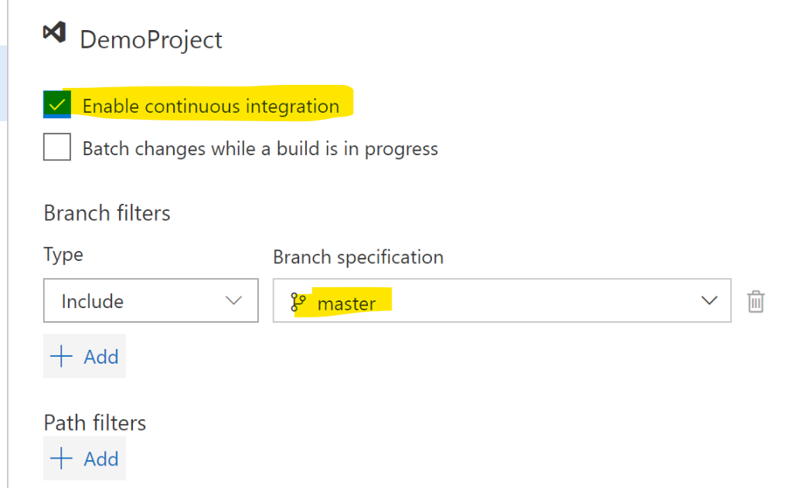

-   Once completed, Save and Queue to verify result

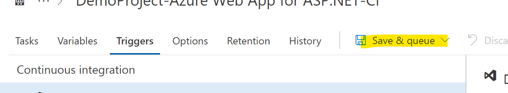

-   Once build and deploy completed we’ve successfully configured VSTS auto
    deployment. Once you commit and push changes to VSTS, it will trigger build
    process to build and deploy to selected Azure Function App.

Working with Function App Slot
==============================

Slot is in preview which enables you to create production/staging environment in
the cloud. In this section we will be modifying our VSTS Build to deploy latest
bits to Staging slot.

-   Slot is in preview, to enable Slot feature, goto Function App Settings

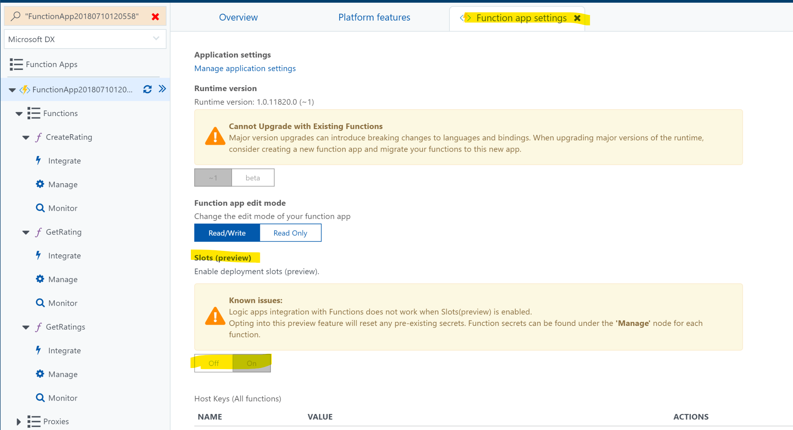

-   Create a new Slot namely “Staging”

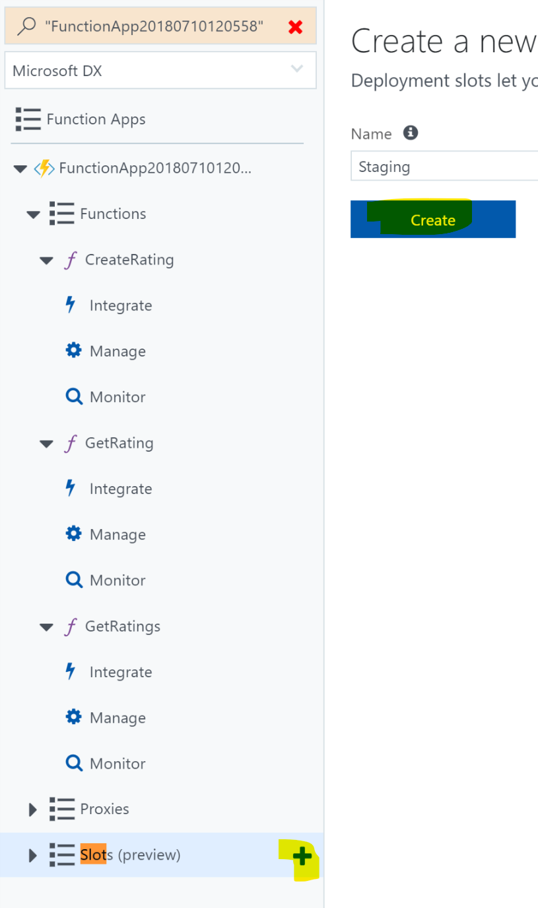

-   Go back to VSTS Build definition, Check “Deploy to Slot” option and choose
    the slot we created.

-   Make sure you update all three deploy tasks then Save.
