## Configure RRAS

### Enable RRAS Role

RDP into the Windows 2019 machine we created. Open up Server Manager and add Remote Access Roles with Direct Access and VPN (RAS) and Routing services.

Once installed, open up RRAS management console via Server Manager

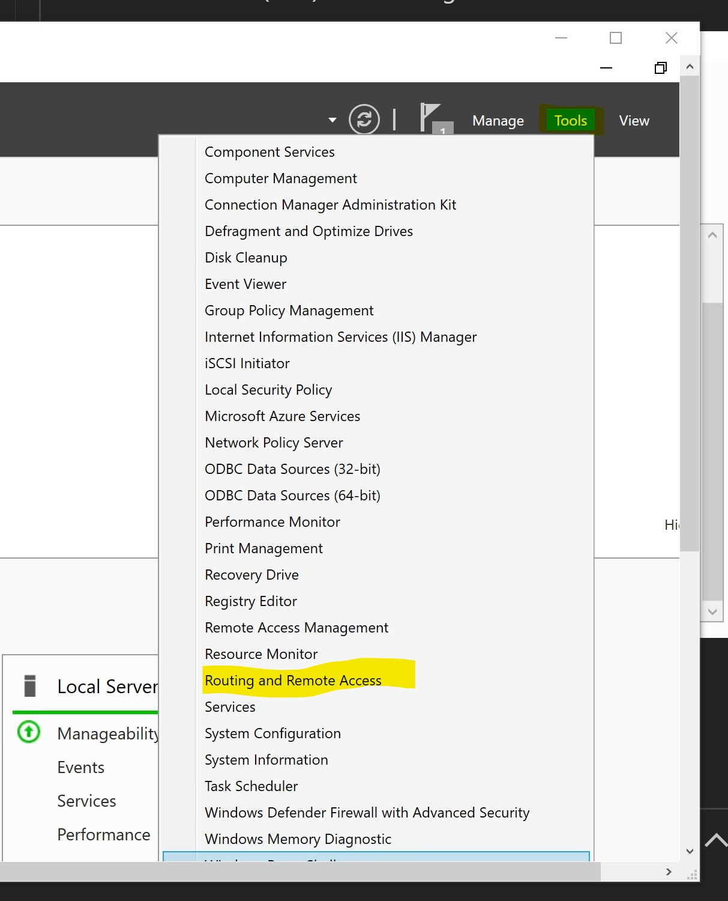

### Configure RRAS

-   Right click the local server, Configure and Enable Routing and Remote Access

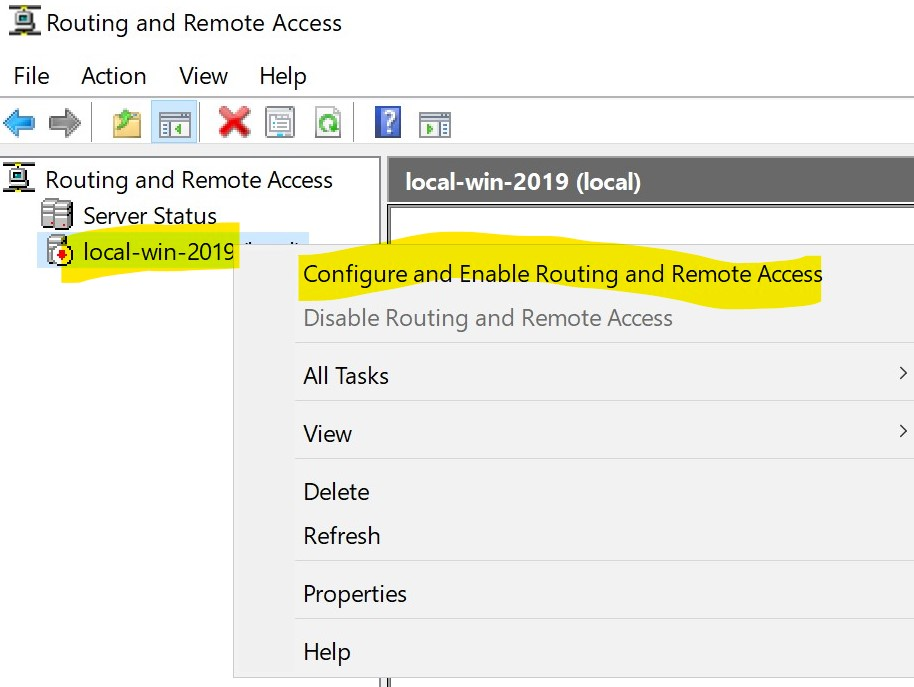

-   Choose Custom Configuration and then check VPN and LAN Routing, wait until service started

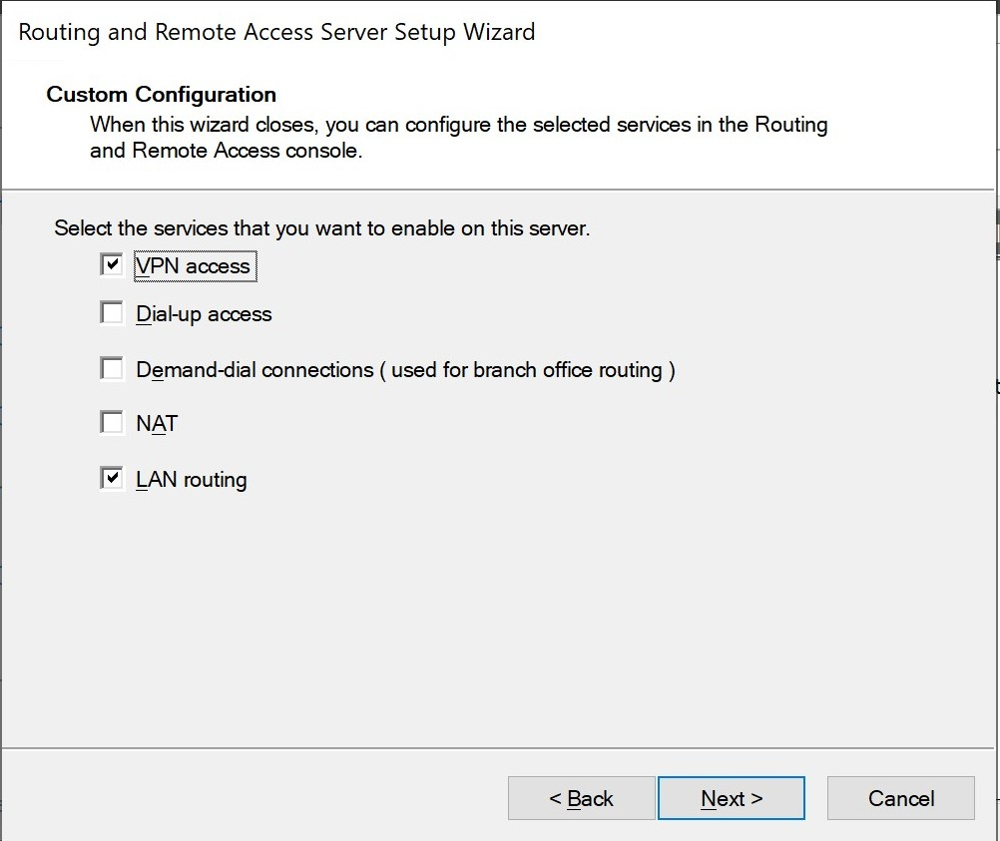

-   Right click on Interface, New Demand-Dial Interface

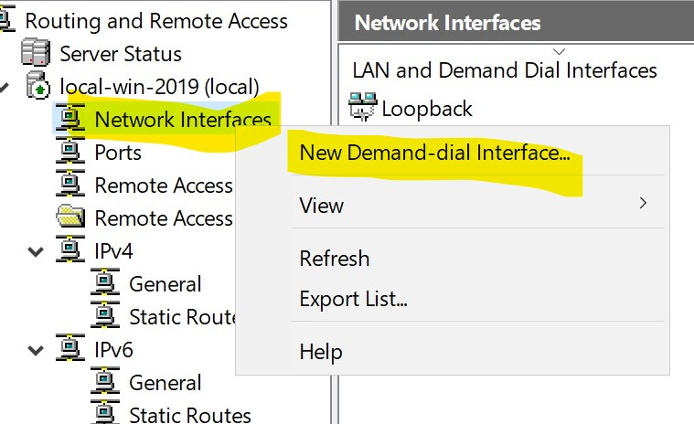

-   Name this new interface as AzureS2S

-   Connect using VPN

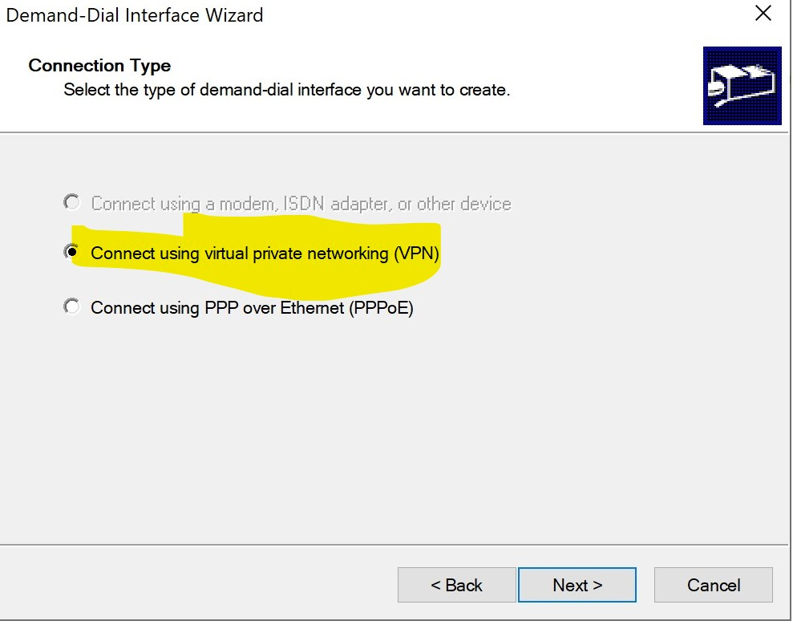

-   Use IKEv2, than Next

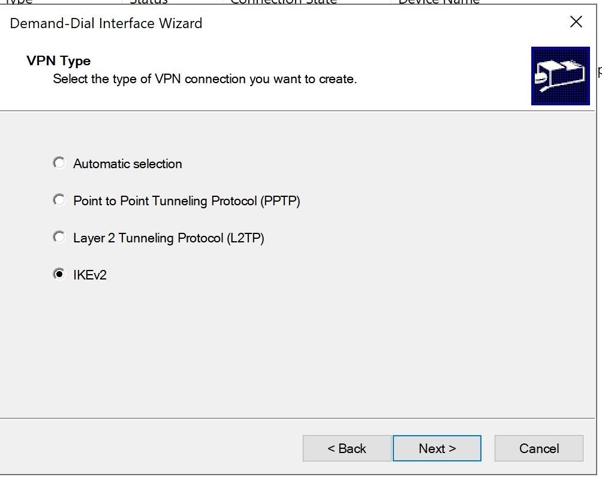

-   Specify destination IP address here, this should be the Cloud-GW IP address

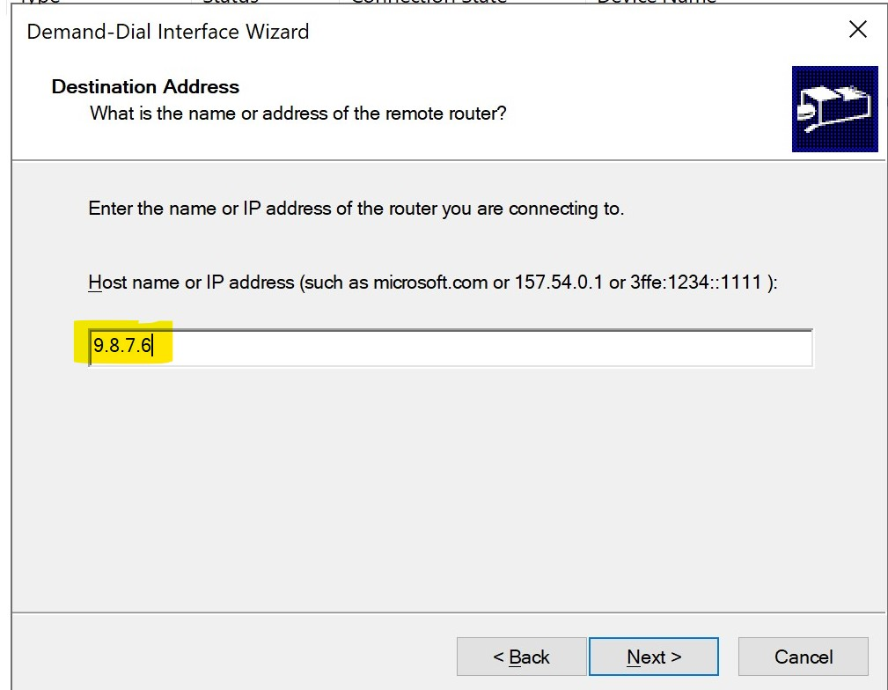

    You can get your cloud gateway from Azure Portal.

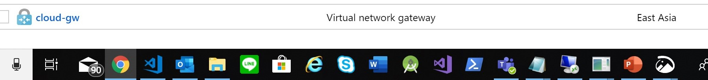

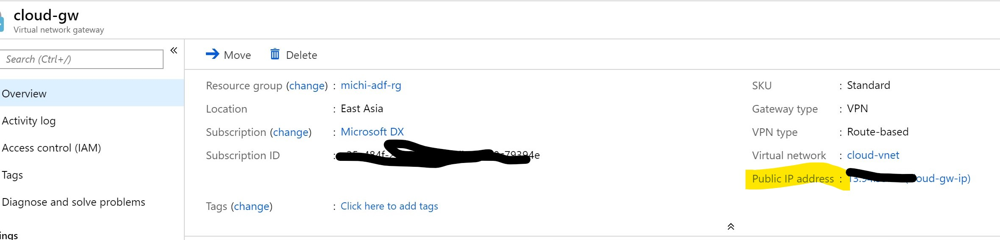

-   check Route Package on this interface

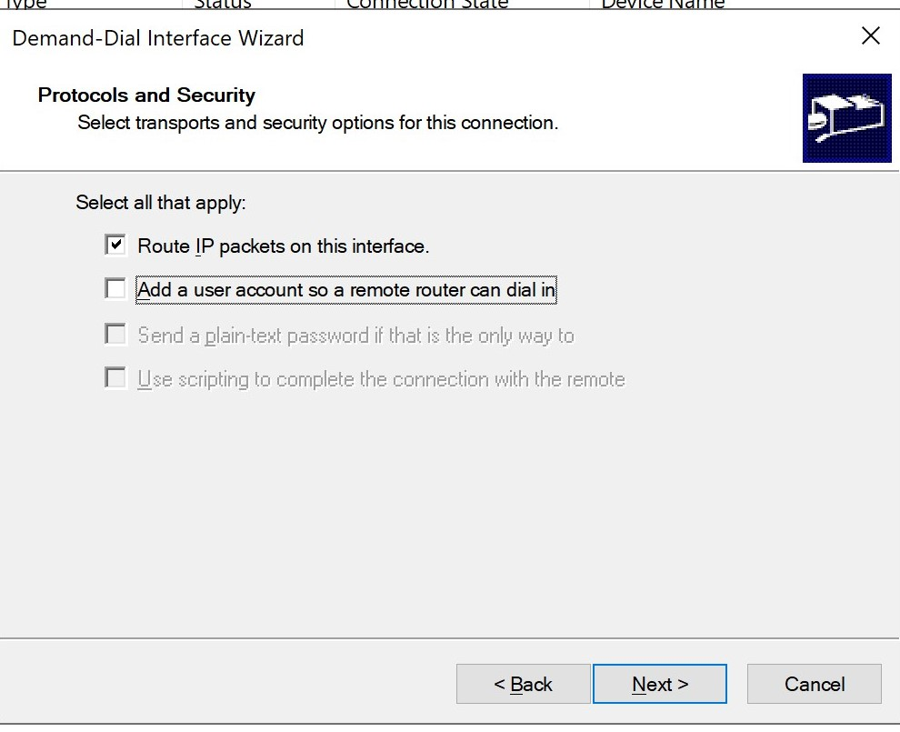

-   Add a static route, the CIDR should be your Cloud Virtual Network's address space. Add than Next.

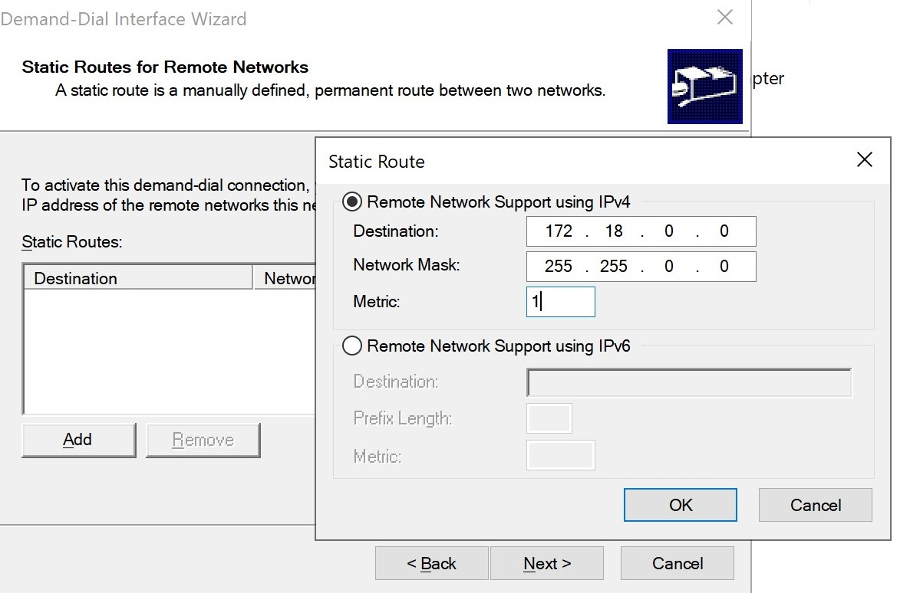

-   Fill in "Azure" as User name, leave other fields empty, click Next and finish this wizard.

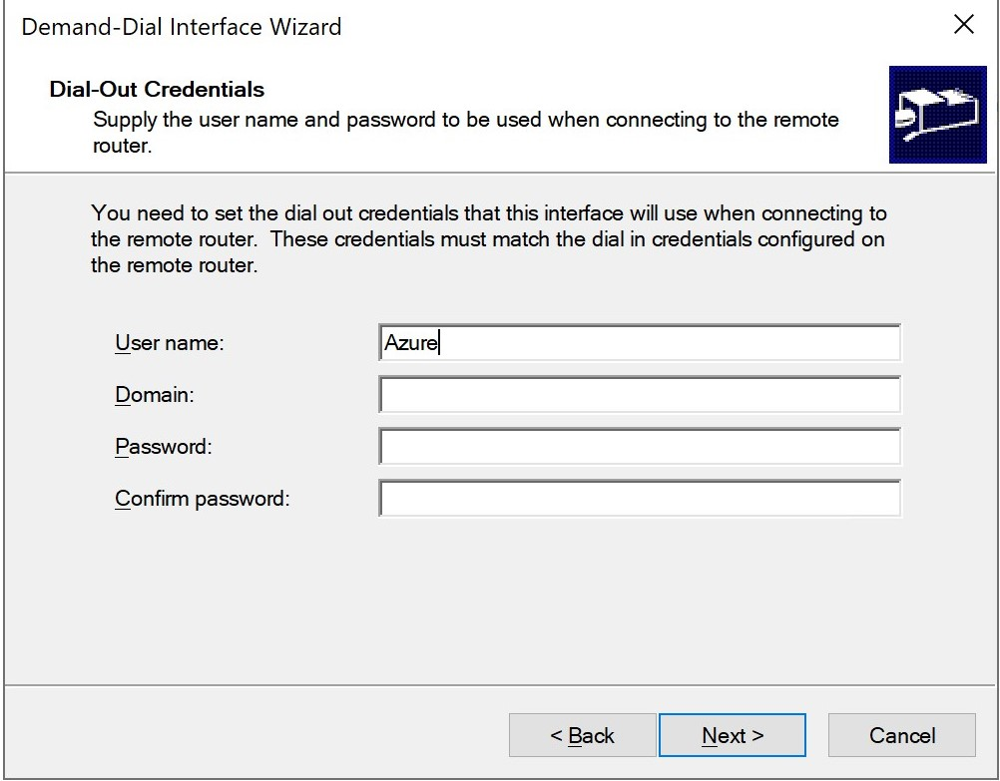

-   Go to Interface, right click on AzureS2S interface, Properties than Security. Check Use Preshared key for authentication, fill in the key we generated previously here.

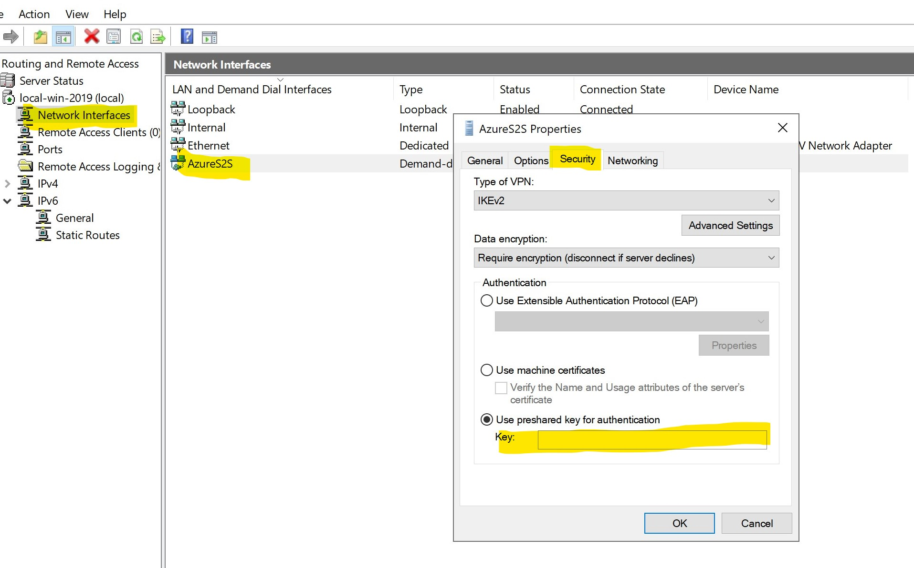

-   Right click AzureS2S interface than click Connect, wait a few seconds you should see status become "Connected"

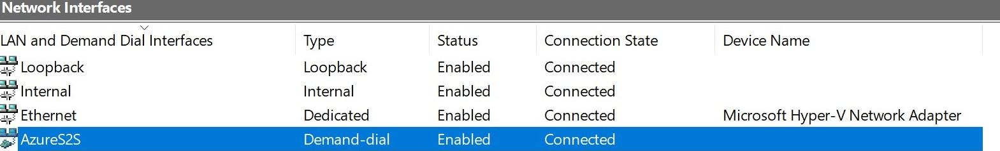

### Create Custom Route Table

-   In order to have local machine communicate to Azure Machines, create a new Route as below

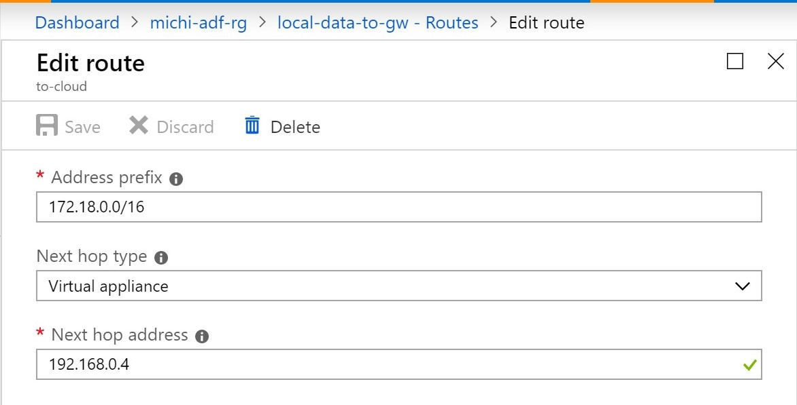

-   Associate it with your local data subnet

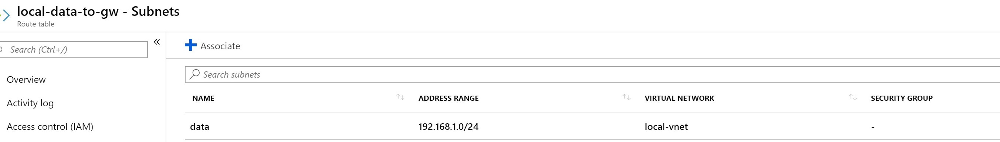