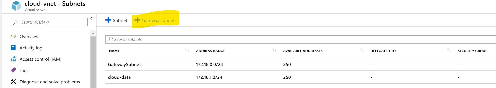
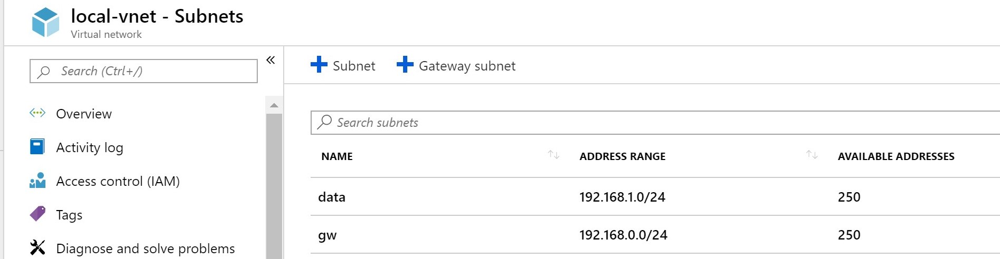
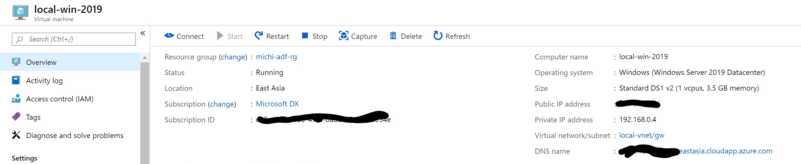
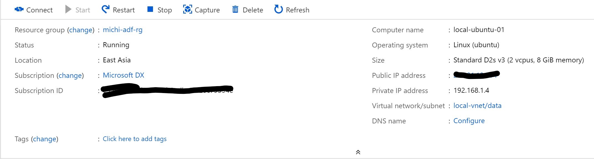
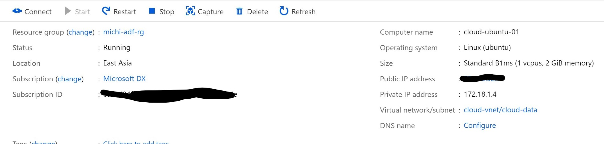

## Setup Environment

### Create Cloud VNet

First step is to create a Virtual Network which represents Azure environment. Below are environment configuration settings

| Type    | Name           | CIDR          |
|---------|----------------|---------------|
|  VNet   | Cloud-VNet     | 172.18.0.0/16 |
|  Subnet | cloud-data     | 172.18.1.0/24 |
|  Subnet | GatewaySubnet  | 172.18.0.0/24 |

>   Note that you do not have to manually create a GatewaySubnet, there is a "Create Gateway Subnet" button which helps. Also the name "GatewaySubnet" is a reserved name only for Virtual Network Gateway.

## Create Local VNet

Next we will be creating another Virtual Network called Local-VNet, below are the configurations.

| Type    | Name           | CIDR           |
|---------|----------------|----------------|
|  VNet   | Local-VNet     | 192.168.0.0/16 |
|  Subnet | data           | 192.168.1.0/24 |
|  Subnet | gw             | 192.168.0.0/24 |

## Create Windows Server 2019 Machine

Create a Windows Server 2019 Virtual Machine and place it in <mark>Local-VNet/gw</mark> network environment with default configuration. 
This machine must have a <mark>Public IP address</mark> so that Azure VNet Gateway is able to communicate with it.

No Network Security Group is required for this machine.

## Create a Local Machine

Create another machine sitting in <mark>Local-VNet/data</mark> subnet. We will use this machine to access cloud resources

## Create a Cloud Machine

Similarly, create a machine sitting in <mark>Clout-VNet/cloud-data</mark> subnet

