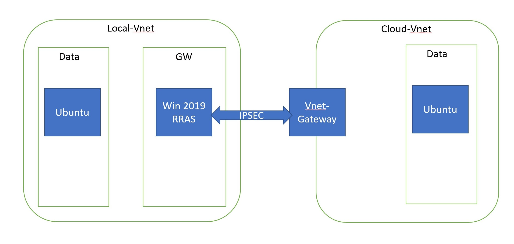

## Overview

In this document I will be setting up a VNet-to-VNet connection with below architecture which uses two Azure VNet, one called Local-Vnet to simulate on-prem environment, the other called Clout-Vnet which is to simualte Azure environment.

In on-prem environment, a Windows Server 2019 RRAS server as VPN device.

## Next Step

[Create Network and Machines](create_vnet.md)

[Setup VNet-to-VNet connection](setup_vnet_connection.md)

[Configure RRAS](configure_RRAS.md)