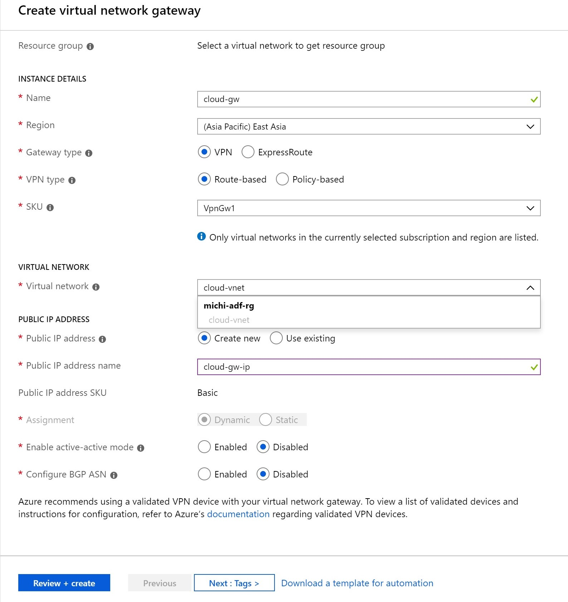
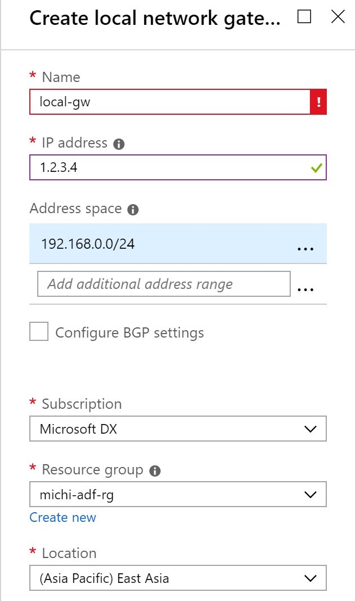
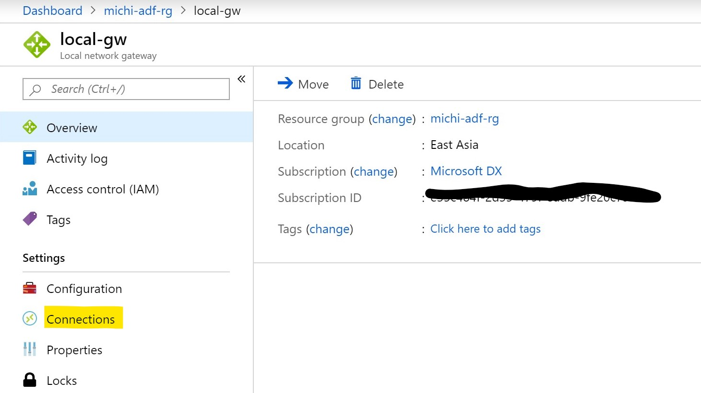

## Table of Contents

[Setup Virtual Network](#setup-virtual-network)

## Setup Virtual Network

### Create VNet Gateway

From Azure Portal, create a new Route-Based, VPN Virtual Network Gateway called <mark>cloud-gw</mark>.

### Create Local Gateway

From Azure Portal, create a new Local Virtual Network Gateway called <mark>local-gw</mark>. Replace the IP address <mark>from 1.2.3.4 to the Public IP Address of your Windows Server 2019</mark> which was created in previous step.

### Create VPN Connection

Once your Cloud Gateway is up and running (it can take around 30 minutes to have the cloud gateway ready and running). We can than create a connection to have cloud gateway talk to on-prem VPN device (the Windows 2019 server)

-   Go to Azure Portal, open Local Gateway we create above, add a new Connection

-   Give this connection a name, here you need to specify a Shared Key, this key will be configured later in RRAS server. It can be any key like "abc123", but for security reason, I am using [this tool](https://my.norton.com/extspa/idsafe?path=pwd-gen) to generate a key.

    Fill in the key here and note it down, we will need it later.

    Wait until it created successfully, we have completed Azure side configuration.