Overview
========

In this document we will be demonstrating deploy a NodeJS Function App with Web3
(and other NodeJS packages) to Azure Function on Linux by Azure DevOps Build and
Release pipeline. This is particularly useful while creating a blockchain
application on Azure as one of a common challenge we were experienced is to
install node packages onto those PaaS environments.

Before creating pipelines, we assume you have

-   Created an empty Javascript Azure Function on Linux

-   Have an working Blockchain environment for testing

-   Have Function App source code push to Azure Repos with below structure

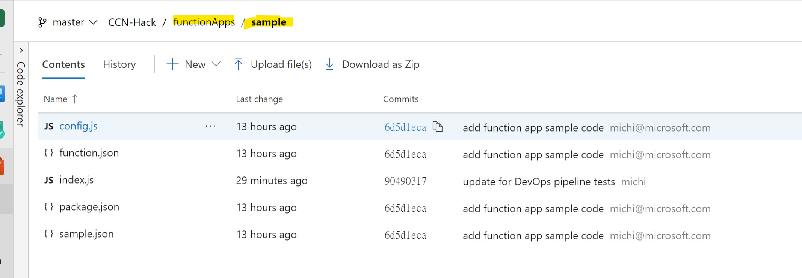

Create Build Pipeline
=====================

-   Go to Azure DevOps portal, create a new Build pipeline. We will use Build
    pipeline to setup NodeJS packages

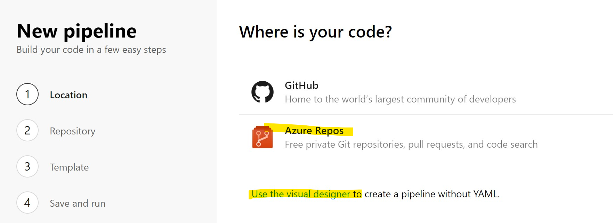

-   In this demo, my source codes are pused to Azure Repos, you can use GitHub
    as well. So select Azure Repos Git has my source codes here.

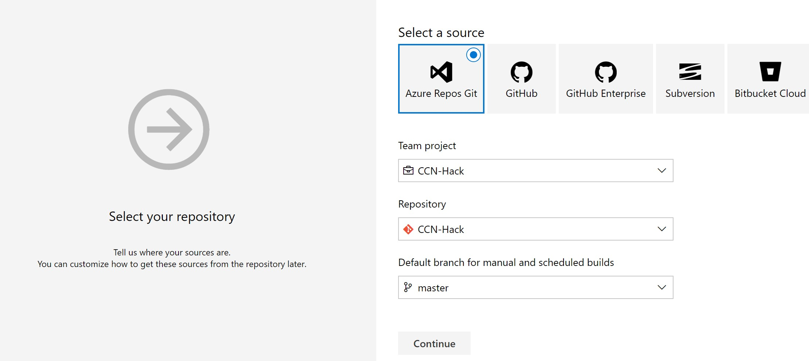

-   For simplicity sake, I am using C\# function template as a base pipeline
    template

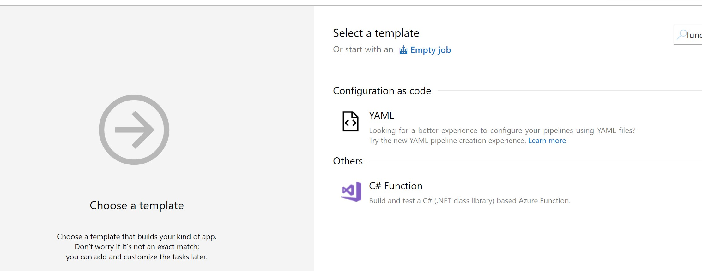

-   Now since we are to deploy to Linux on Azure Function, here we will be using
    Ubuntu agent

-   We also want to remove some unused tasks, such NuGet restore, NuGet 4.4.1
    task.

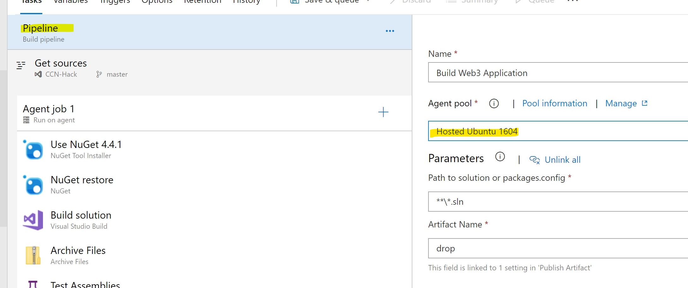

-   Add a npm task to the pipeline

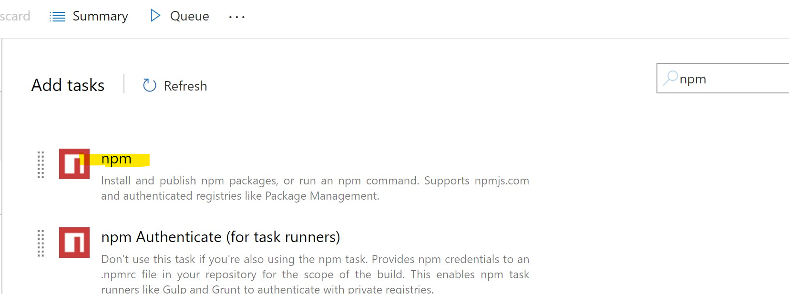

-   Set command to “install”, which is the default

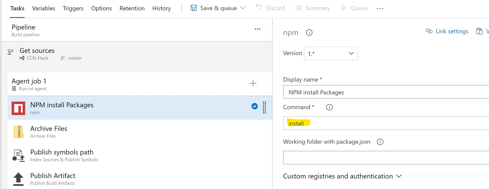

-   Now change package.json folder to sample

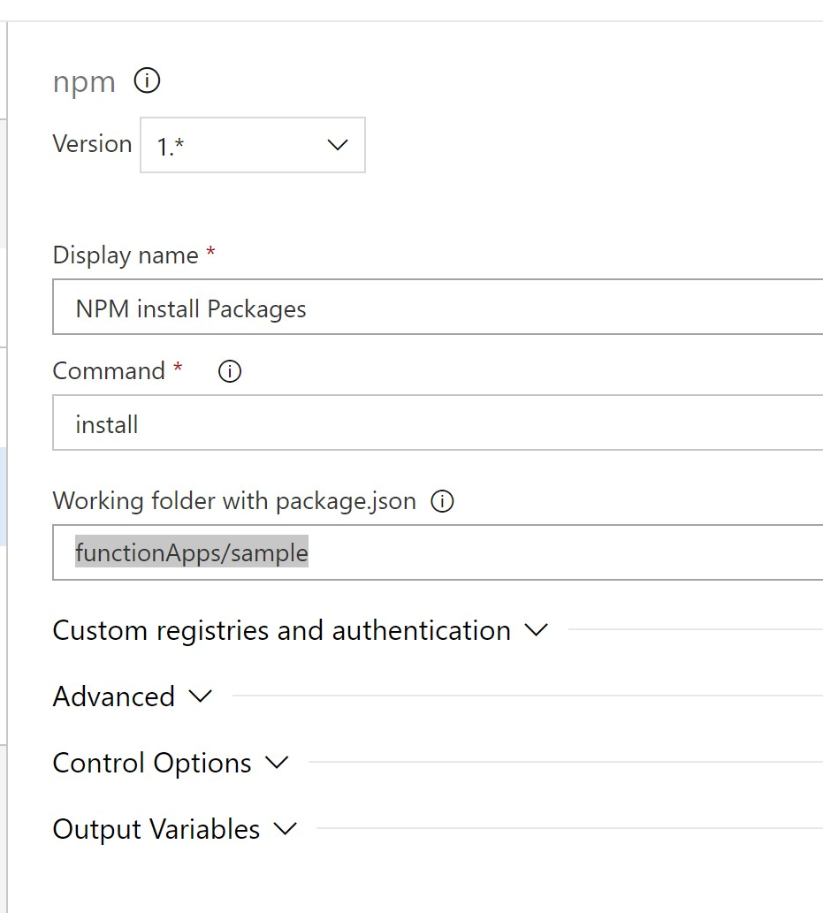

-   Change Root Folder of archive file to functionApps folder and DO NOTcheck
    “Prepend root folder name to archive paths”

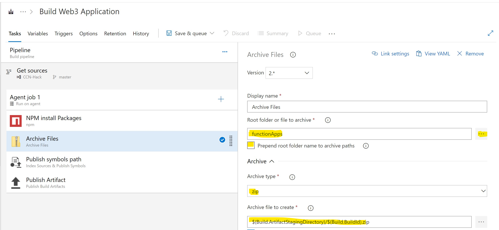

-   Add another task to specify NodeJS version

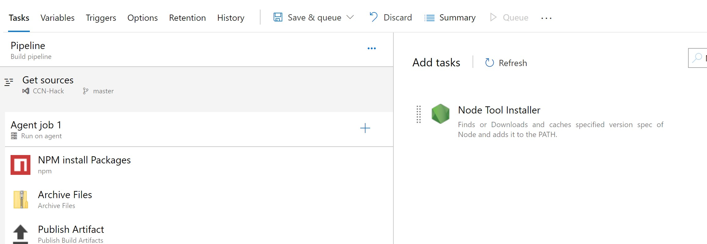

-   We will be using NodeJS version 8.11.X here.

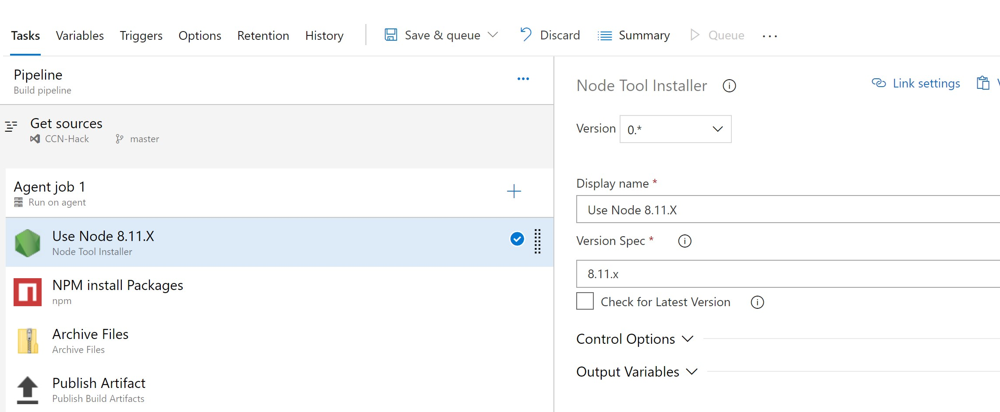

-   You pipeline should be similar to this

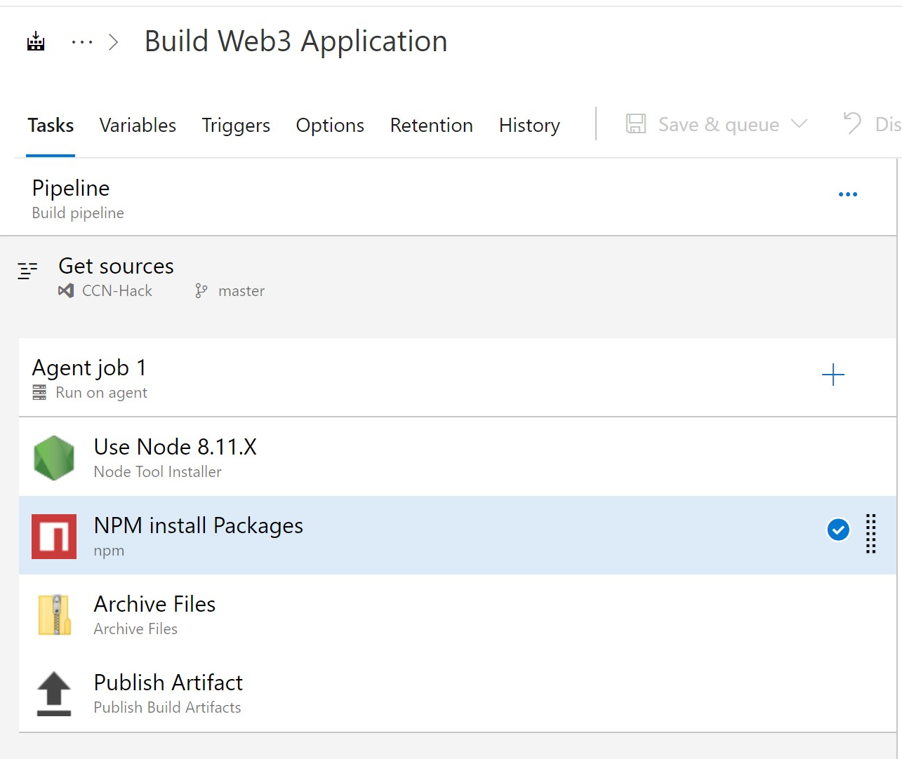

-   Save and Queue.

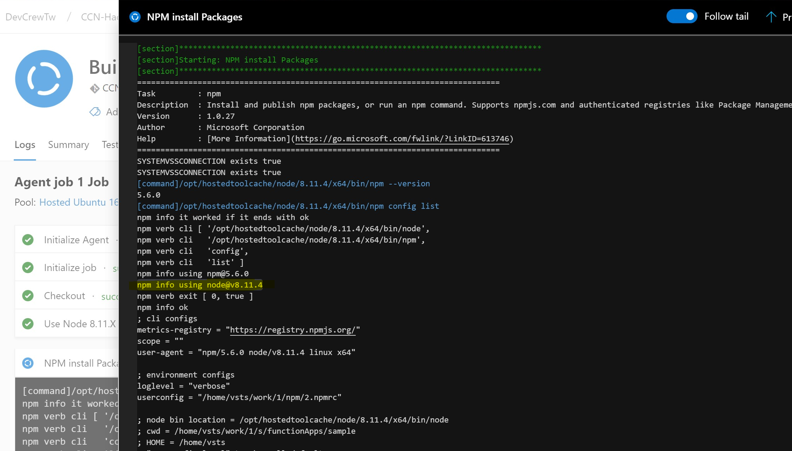

Create Release Pipeline
=======================

-   Create a new Release pipeline with Azure App Service deployment template

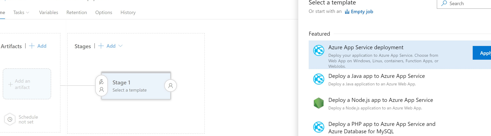

-   Select correct Subscription and App Type, you may need to manually input App
    Service name if it’s not present

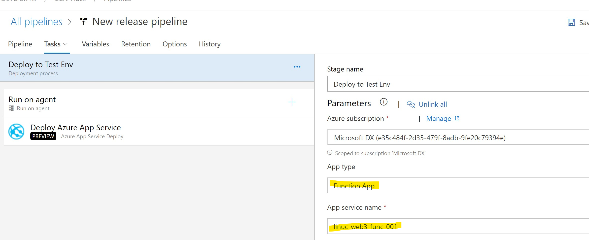

-   Go to Deploy Azure App Service Task, change version to 4.\* (Preview), leave
    others default

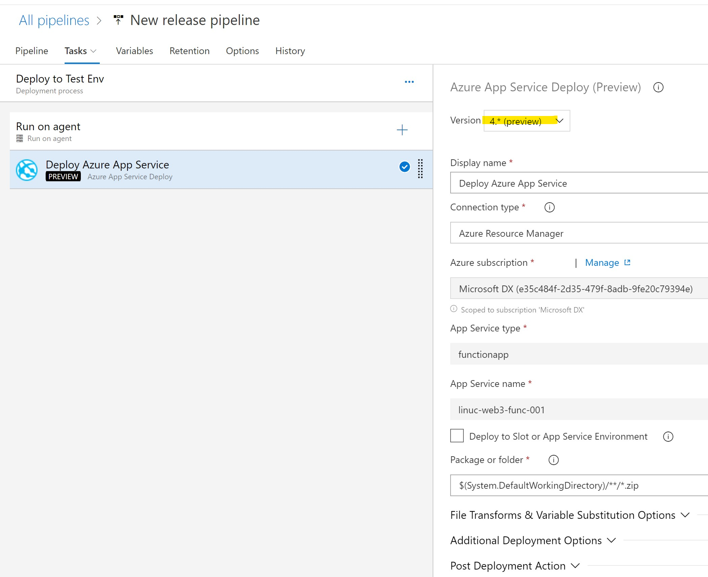

-   Save the Stage and add Artifact

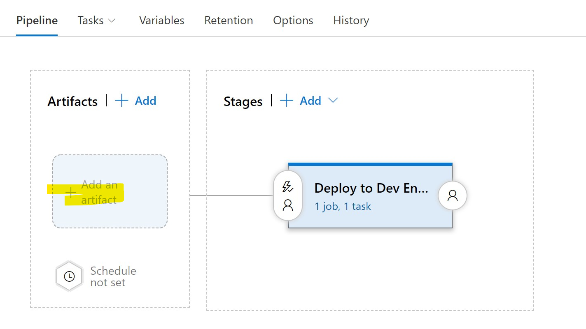

-   Choose artifact from the last build

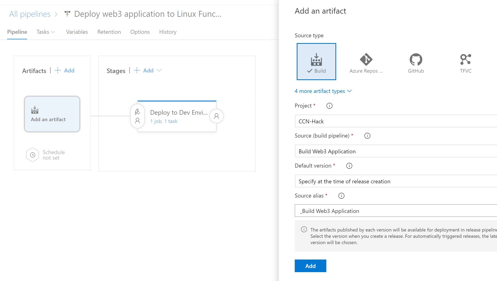

-   Save and create a release to kick-off deployment
